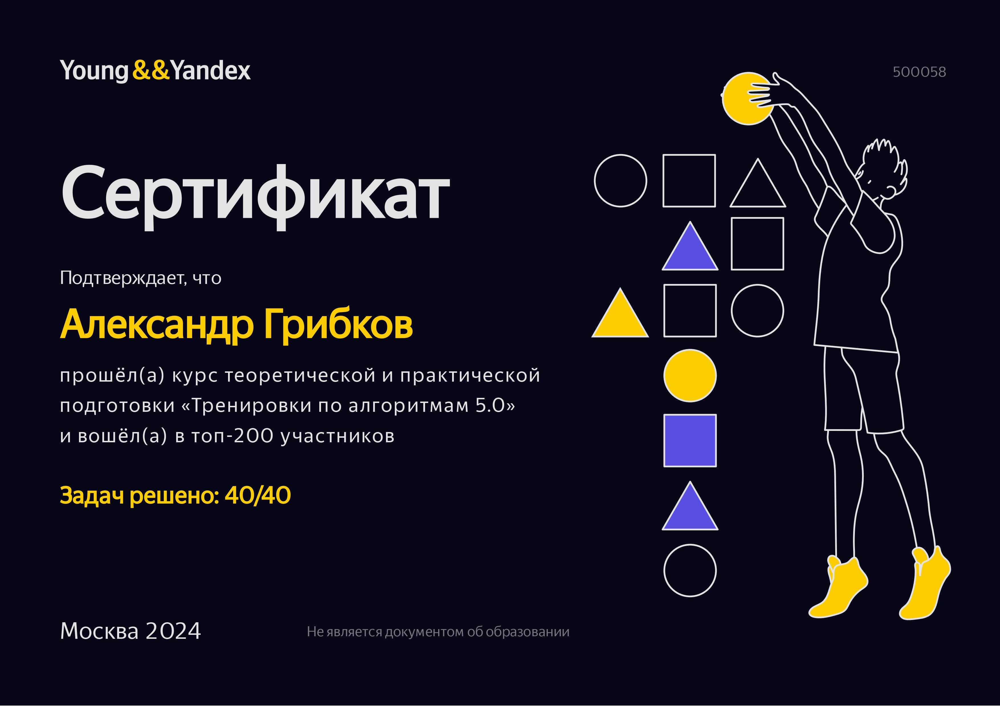

# Тренировки по алгоритмам от Яндекса

Мои решения задач тренировки по алгоритмам 5.0.

### Занятие 1 (Сложность, тестирование, особые случаи)

Лекция 1: [Сложность, тестирование, особые случаи](https://www.youtube.com/watch?v=SVkJ77_Fl1o)

[Разбор задач первой лекции](https://www.youtube.com/watch?v=IesJVRj-Q40)

Решение:

1. [A. Покраска деревьев](src/complexity/PaintingTrees.kt)
2. [B. Футбольный комментатор](src/complexity/FootballCommentator.kt)
3. [C. Форматирование файла](src/complexity/FileFormatting.kt)
4. [D. Слоны и ладьи](src/complexity/BishopsAndRooks.kt)
5. [E. Прибыльный стартап](src/complexity/ProfitableStartup.kt)
6. [F. Миша и математика](src/complexity/MishaAndMathematics.kt)
7. [G. Разрушить казарму](src/complexity/DestroyBarracks.kt)
8. [H. Забег по стадиону](src/complexity/RaceAroundStadium.kt)
9. [I. Расписание](src/complexity/Schedule.kt)
10. [J. Форматирование документа](src/complexity/CharArrayVersion.kt)

### Занятие 2 (Линейный поиск)

Лекция 2: [Линейный поиск](https://www.youtube.com/watch?v=7P4yu7rQADI)

[Разбор задач второй лекции](https://www.youtube.com/watch?v=PyLX9vzrwqY)

Решение:

1. [A. Минимальный прямоугольник](src/linearsearch/MinimalRectangle.kt)
2. [B. Продавец рыбы](src/linearsearch/FishSeller.kt)
3. [C. Петя, Маша и верёвочки](src/linearsearch/Ropes.kt)
4. [D. Шахматная доска](src/linearsearch/ChessBoard.kt)
5. [E. Амбициозная улитка](src/linearsearch/AmbitiousSnail.kt)
6. [F. Колесо Фортуны](src/linearsearch/WheelOfFortune.kt)
7. [G. Ни больше ни меньше](src/linearsearch/NoMoreNoLess.kt)
8. [H. Наилучший запрет](src/linearsearch/BestBan.kt)
9. [I. Пираты Баренцева моря](src/linearsearch/PiratesOfBarentsSea.kt)
10. [J. Два прямоугольника](src/linearsearch/TwoRectangles.kt)

### Занятие 3 (Множества и словари)

Лекция 3: [Множества и словари](https://www.youtube.com/watch?v=jQOnYzW8ZOE)

[Разбор задач третьей лекции](https://www.youtube.com/watch?v=GQdvaoPxbZE)

Решение:

1. [A. Плейлисты](src/setsandmaps/Playlists.kt)
2. [B. Анаграмма?](src/setsandmaps/Anagram.kt)
3. [C. Удаление чисел](src/setsandmaps/RemovingNumbers.kt)
4. [D. Повторяющееся число](src/setsandmaps/RepeatingNumber.kt)
5. [E. Два из трех](src/setsandmaps/TwoOutOfThree.kt)
6. [F. Замена слов](src/setsandmaps/ReplacingWords.kt)
7. [G. Построить квадрат](src/setsandmaps/BuildSquare.kt)
8. [H. Спички детям не игрушка!](src/setsandmaps/MatchesAreNotToyForChildren.kt)
9. [I. Играйте в футбол!](src/setsandmaps/PlayFootball.kt)
10. [J. P2P обновление](src/setsandmaps/P2PUpdate.kt)

### Занятие 4 (Бинарный поиск)

Лекция 4: [Бинарный поиск](https://www.youtube.com/watch?v=-B6xvDeGyPg)

[Разбор задач четвертой лекции](https://www.youtube.com/watch?v=H2qC2rFES-s)

Решение:

1. [A. Быстрый поиск в массиве](src/binarysearch/QuickSearchInArray.kt)
2. [B. Одномерный морской бой](src/binarysearch/OneDimensionalNavalCombat.kt)
3. [C. Саруман](src/binarysearch/Saruman.kt)
4. [D. Рапорт](src/binarysearch/Report.kt)
5. [E. Нумерация дробей](src/binarysearch/NumberingFractions.kt)
6. [F. Велодорожки](src/binarysearch/CyclePaths.kt)
7. [G. Новый офис плюса](src/binarysearch/newofficeplus)
8. [H. Выборы](src/binarysearch/Elections.kt)
9. [I. Лапта](src/binarysearch/Lapta.kt)
10. [J. Дождик](src/binarysearch/Rain.kt)

# Algorithms training in Yandex

My solutions to algorithms training 5.0 problems.

Topics:

1. [Complexity, testing, special cases](src/complexity)
2. [Linear search](src/linearsearch)
3. [Sets and dictionaries](src/setsandmaps)
4. [Binary Search](src/binarysearch)

## Certificate

